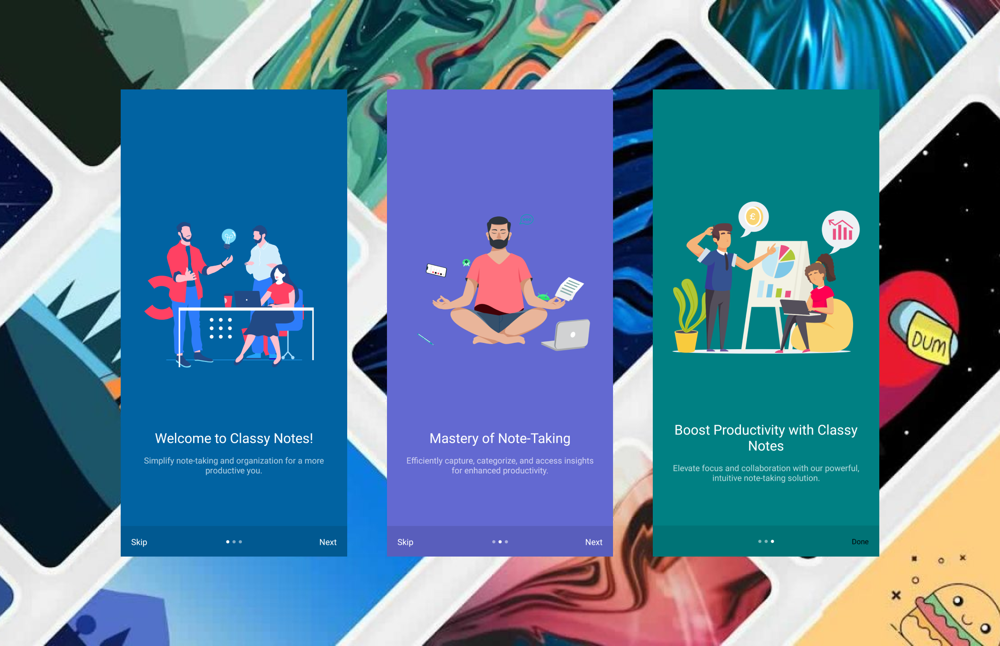

# Classy Notes


A beautiful note taking mobile app built with React Native, Lottie Animations, Typescript, React Query and Firebase.

## Features

- **User-friendly Interface:**

  - Intuitive and easy-to-navigate design for a seamless user experience.

- **Create, Update, and Delete Notes:**

  - Ability to create new notes with titles and content.
  - Edit and update existing notes effortlessly.
  - Conveniently delete notes when no longer needed.

- **Rich Text Editor:**

  - Powerful rich text editor for formatting notes with bold, italic, bullet points, and more.
  - Support for headings, lists, quotes, and code blocks for organized content.

- **Bookmarking:**

  - Add bookmarks to important notes for quick reference.
  - Easy access to bookmarked notes for efficient retrieval.

- **Google Authentication:**

  - Securely sign in using Google accounts for streamlined access.
  - Maintain data privacy and user security with Google's authentication framework.

- **Smooth UI with Lottie Animations:**

  - Enhance user experience with fluid animations using Lottie.
  - Engaging transitions and loading animations for a visually appealing interface.

- **Cloud Sync and Backup:**
  - Synchronize notes across devices for seamless access on the go.
  - Automatically back up notes to the cloud to prevent data loss.

## Live APK

Coming Soon

<!-- [Download](./download.apk) -->

## View Preview

[](https://youtu.be/ldbconEZ040)

## Screenshots

### Onboarding Screen



### Login Screen


### Notes Screens


## Installation

1. Clone the repo.
   ```bash
   git clone https://github.com/sahilverma-dev/classy-notes
   ```
2. Open the folder

   ```bash
   cd classy-notes
   ```

3. Install the dependencies by running `npm install`
4. Add your credentials on `firebase/config.ts` as `context/AuthContext.tsx` files.
5. Start the development server by running `npm start`

## Technologies

- React Native (Typescript)
- Tailwind CSS
- React Query
- Firebase
- Lottie Animations

## Contact

In case of any issues or for any other inquiries, please contact me at sahilverma.webdev@gmail.com
